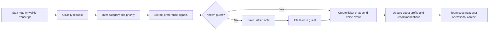
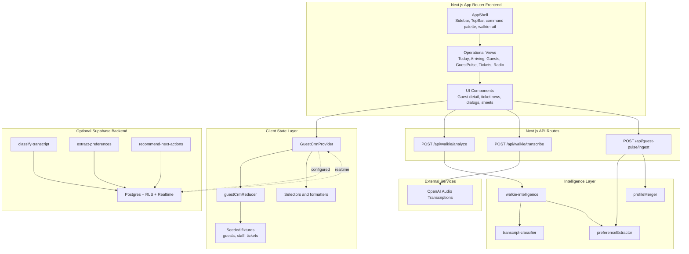
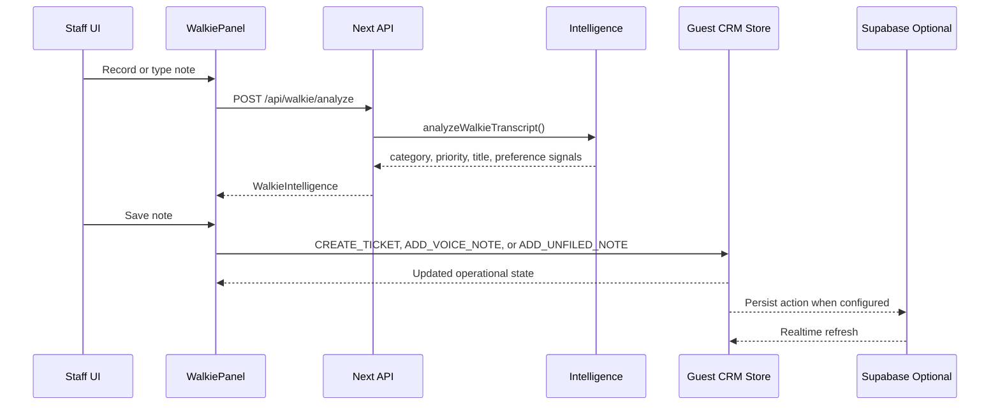
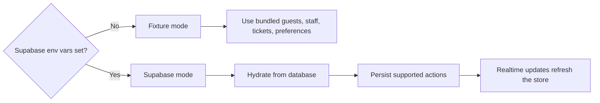

# RosePulse

> **Voice-first guest operations CRM for luxury hospitality teams**

RosePulse centralizes arrivals, guest profiles, service tickets, and walkie-style voice notes so hotel teams can turn operational signals into coordinated guest care.

[](https://nextjs.org)
[](https://react.dev)
[](https://www.typescriptlang.org)
[](https://supabase.com)
[](https://platform.openai.com/docs)

---

## Table of Contents

- [Overview](#overview)
- [Architecture](#architecture)
- [Features](#features)
- [Quick Start](#quick-start)
- [API Reference](#api-reference)
- [Tech Stack](#tech-stack)
- [Project Structure](#project-structure)
- [Testing](#testing)
- [Configuration](#configuration)

---

## Overview

Luxury property teams juggle arrivals, guest preferences, service recovery, and radio chatter across multiple departments. RosePulse provides a single operations surface for:

1. **Daily Operations** - Monitor arrivals, active tickets, VIP context, and department workload.
2. **Guest Profiles** - Review stay details, preferences, notes, recommendations, and service history.
3. **Walkie Capture** - Record or type operational notes, classify them, and file them to guests or tickets.
4. **GuestPulse Intelligence** - Extract preference signals from intake text and merge them into enriched profiles.
5. **Supabase Sync Path** - Run from local fixtures by default, then hydrate and persist through Supabase when configured.

### The Core Loop



---

## Architecture

### System Overview



### Walkie-to-Ticket Flow



### Data Modes



---

## Features

### Operations Dashboard

- **Today View** - Active operational snapshot for arrivals, incidents, and service cadence.
- **Arriving View** - Arrival-focused planning with guest context and property imagery.
- **Tickets View** - Service tickets with category, priority, status, assignment, comments, and escalation.
- **Radio View** - Voice-note workflow for filing operational updates.

### Guest CRM

- **Guest Directory** - Browse guest cards, segments, stay context, and active needs.
- **Guest Detail Drawer** - Review preferences, tickets, stay metadata, and recent activity.
- **Command Palette** - Fast app navigation and guest lookup.
- **Responsive Shell** - Desktop sidebar, docked walkie rail, mobile sheets, and safe-area support.

### Walkie Intelligence

- **Browser Speech Capture** - Uses local speech recognition when available.
- **Server Transcription Fallback** - Uses OpenAI audio transcription through `/api/walkie/transcribe`.
- **Transcript Classification** - Maps notes to guest relations, room, housekeeping, security, F+B, or spa.
- **Priority Inference** - Detects urgent and high-priority operational language.
- **Preference Signals** - Extracts candidate guest preferences from staff notes and voice events.

### Supabase Backend Scaffold

- **Schema + Seed Data** - Migrations and seed SQL live under `supabase/`.
- **RLS-Aware Auth Path** - Staff-to-property membership model for authenticated access.
- **Realtime Refresh** - Client store can refresh when Supabase changes arrive.
- **Edge Functions** - Deterministic classify, extract, and recommendation functions ready for provider-backed AI later.

---

## Quick Start

### Prerequisites

- Node.js 18+
- pnpm 9+
- OpenAI API key for server transcription
- Supabase CLI and project credentials if using the backend sync path

### 1. Install Dependencies

```bash
pnpm install
```

### 2. Configure Environment

```bash
cp .env.example .env.local
```

For fixture-only development, the Supabase values can remain empty. Add `OPENAI_API_KEY` if you want the server transcription endpoint to work:

```bash
OPENAI_API_KEY=sk-your-openai-key
OPENAI_TRANSCRIBE_MODEL=gpt-4o-mini-transcribe
```

For Supabase mode, set:

```bash
NEXT_PUBLIC_SUPABASE_URL=your-supabase-url
NEXT_PUBLIC_SUPABASE_PUBLISHABLE_KEY=your-publishable-key
NEXT_PUBLIC_ROSEPULSE_PROPERTY_ID=00000000-0000-4000-8000-000000000001
ROSEPULSE_AI_PROVIDER=deterministic
```

### 3. Run the App

```bash
pnpm dev
```

Open [http://localhost:3000](http://localhost:3000). The root route redirects to `/today`.

### 4. Optional Supabase Setup

```bash
supabase start
supabase db reset
pnpm supabase:seed:export
```

See [`supabase/README.md`](supabase/README.md) for the auth bootstrap and provider notes.

---

## API Reference

### `POST /api/walkie/analyze`

Classifies a transcript, infers priority, creates a short title, and returns candidate preference signals.

```json
{
  "transcript": "Guest in villa 4 needs hypoallergenic pillows before arrival.",
  "guestId": "g_001",
  "ticketId": "t_001"
}
```

Response:

```json
{
  "category": "housekeeping",
  "priority": "high",
  "title": "Guest in villa 4 needs hypoallergenic pillows before arrival.",
  "routeConfidence": 0.82,
  "signals": []
}
```

### `POST /api/walkie/transcribe`

Transcribes uploaded audio with OpenAI. The request must be `multipart/form-data` with an `audio` field and optional `lang` field.

Response:

```json
{
  "text": "Please send housekeeping to the guest suite.",
  "model": "gpt-4o-mini-transcribe"
}
```

### `POST /api/guest-pulse/ingest`

Validates an intake record, extracts preference signals, and merges them into an enriched guest profile.

```json
{
  "guestId": "g_001",
  "sourceType": "staff_note",
  "sourceDepartment": "concierge",
  "rawText": "Prefers a quiet room and tea service after arrival."
}
```

Response:

```json
{
  "signals": [],
  "enrichedProfile": {}
}
```

---

## Tech Stack

- **Framework** - Next.js 15 App Router, React 19, TypeScript
- **UI** - Tailwind CSS 4, Radix UI, shadcn-style components, lucide-react, Recharts
- **State** - React reducer/context with fixture fallback and optional Supabase persistence
- **Validation** - Zod
- **AI + Voice** - OpenAI audio transcription, deterministic transcript classification, preference extraction
- **Backend** - Supabase Postgres, RLS, Realtime, Edge Functions
- **Testing** - Vitest

---

## Project Structure

```text
.
├── app/
│   ├── (app)/                    # Authenticated-style application routes
│   │   ├── arriving/
│   │   ├── guest-pulse/
│   │   ├── guests/
│   │   ├── radio/
│   │   ├── tickets/
│   │   └── today/
│   ├── api/
│   │   ├── guest-pulse/ingest/
│   │   └── walkie/
│   ├── layout.tsx
│   └── page.tsx                  # Redirects to /today
├── components/
│   ├── app/                      # RosePulse application components
│   └── ui/                       # Shared UI primitives
├── hooks/
│   ├── use-hotkeys.ts
│   └── use-walkie.ts
├── lib/
│   ├── fixtures/                 # Seed guests, staff, and tickets
│   ├── store/                    # Reducer, selectors, context provider
│   ├── supabase/                 # Client, queries, realtime, mappers
│   ├── guestPulseIngest.ts
│   ├── preferenceExtractor.ts
│   ├── profileMerger.ts
│   ├── transcript-classifier.ts
│   └── walkie-intelligence.ts
├── public/                       # Icons and Rosewood Sand Hill imagery
├── scripts/
│   └── export-supabase-seed.mjs
└── supabase/
    ├── functions/                # Edge function scaffold
    ├── migrations/
    ├── seed.sql
    └── tests/
```

---

## Testing

Run the unit test suite:

```bash
pnpm test
```

Run static checks:

```bash
pnpm lint
pnpm typecheck
```

Key covered areas include:

- GuestPulse ingestion validation and profile merge behavior
- Preference extraction
- Reducer ticket and voice-note state transitions
- Walkie transcript classification and priority inference

---

## Configuration

| Variable | Required | Description |
| --- | --- | --- |
| `OPENAI_API_KEY` | For transcription | Enables `/api/walkie/transcribe`. |
| `OPENAI_TRANSCRIBE_MODEL` | No | Overrides the default `gpt-4o-mini-transcribe` model. |
| `NEXT_PUBLIC_SUPABASE_URL` | For Supabase mode | Supabase project URL. |
| `NEXT_PUBLIC_SUPABASE_PUBLISHABLE_KEY` | For Supabase mode | Supabase browser-safe publishable key. |
| `NEXT_PUBLIC_ROSEPULSE_PROPERTY_ID` | No | Property ID used by Supabase queries and seed data. |
| `ROSEPULSE_AI_PROVIDER` | No | Defaults to `deterministic` for Edge Function fallback behavior. |

When Supabase is not configured, RosePulse runs from local fixture data and remains fully usable for frontend development.
